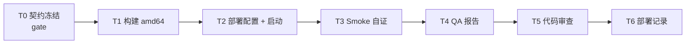

# SUIB-12 任务分解 (DAG)

Issue: `01a061ff-d640-77ec-84c9-5a34c86757a9` (SUIB-12)
Delivery dir: `.delivery/01a061ff-d640-77ec-84c9-5a34c86757a9/`
Baseline: `release` @ `2a9f762845c60e998622ac33ef4d8ee6155993f3`
Feature branch: `agent/full-delivery/suib-12-rebuild-amd64` (建议)
Image tag: `suib-12-YYYYMMDD`

---

## DAG 总览

> **无环**：T0 → T1 → T2 → T3 → T4 → T5 → T6 单链；Dev/QA/Reviewer/DevOps 角色串行交接。
> **gate**：仅 T0（契约冻结）。

---

## T0 — API / Health 契约冻结 [gate]

| 字段 | 值 |
|------|-----|
| owner | architect |
| gate | **true** |
| deps | — |
| files (file-disjoint) | [`.delivery/01a061ff-d640-77ec-84c9-5a34c86757a9/stack.yaml`, `.delivery/01a061ff-d640-77ec-84c9-5a34c86757a9/design.md`, `.delivery/01a061ff-d640-77ec-84c9-5a34c86757a9/tasks.md`] |
| scope | 锁定 T0 smoke endpoints 与 HealthResponse schema |
| output | T0 章节 (design.md §4) + stack.yaml `t0_contract` |
| verify_cmd | `test -f .delivery/01a061ff-d640-77ec-84c9-5a34c86757a9/stack.yaml && grep -q '^api_contract:' .delivery/01a061ff-d640-77ec-84c9-5a34c86757a9/stack.yaml && grep -q '## 4. T0 契约' .delivery/01a061ff-d640-77ec-84c9-5a34c86757a9/design.md` |

**门禁：** Leader 确认 T0 文件存在且 t0_contract 字段非空后，T1 方可开始。

---

## T1 — 构建 linux/amd64 三件套镜像

| 字段 | 值 |
|------|-----|
| owner | developer-backend |
| gate | false |
| deps | [T0] |
| files (file-disjoint) | [`deploy/dockerhub/publish.sh`, `MemoryCore/Dockerfile`, `MemoryProxy/Dockerfile`, `deploy/panel-knowledge-combined/Dockerfile`, `MemoryPanel/scripts/secret-scan.sh`] |
| scope | 从 `release` checkout 构建三件套 amd64 镜像，tag `suib-12-YYYYMMDD` |
| output | 本地镜像：`agentmemory/memory-core:suib-12-*`、`agentmemory/memory-proxy:suib-12-*`、`agentmemory/memory-hub:suib-12-*` |
| verify_cmd | `VERSION=suib-12-$(date +%Y%m%d) bash -c 'set -e; cd deploy/dockerhub && PUSH=0 LOAD_PLATFORM=linux/amd64 ./publish.sh all && for img in memory-core memory-hub memory-proxy; do docker image inspect agentmemory/${img}:${VERSION} --format "{{.Architecture}}" | grep -qx amd64; done'` |
| acceptance | AC1 |
| fallback | `cd deploy/internal-team && PLATFORM=linux/amd64 TAG=suib-12-$(date +%Y%m%d) ./build-local.sh`（仅在主路径失败时使用，需 PR 注明） |

---

## T2 — 本机部署配置与启动

| 字段 | 值 |
|------|-----|
| owner | developer-backend |
| gate | false |
| deps | [T1] |
| files (file-disjoint) | [`deploy/global-images/.env.example`, `deploy/global-images/.env`（不入仓）, `deploy/global-images/start-all.sh`, `deploy/global-images/start-memory-core.sh`, `deploy/global-images/verify.sh`, `deploy/global-images/_lib.sh`] |
| scope | (1) `cp .env.example .env`，设置三个 `*_IMAGE` 指向 T1 tag；(2) 配置 MEMORY_LLM_*/PROXY_UPSTREAM_*（可手动预填以跳过交互）；(3) `start-all.sh` 拉起三容器 |
| output | 三容器 running（`docker ps` 中可见 `tdai-memory-core` / `tdai-memory-hub` / `tdai-proxy`，状态非 `Restarting`） |
| verify_cmd | `bash -c 'set -e; cd deploy/global-images && ./verify.sh --skip-llm && docker ps --format "{{.Names}} {{.Status}}" | grep -E "tdai-memory-core|tdai-memory-hub|tdai-proxy" | grep -v Restarting | wc -l | grep -qx 3'` |
| acceptance | AC2, AC4(脚本用法部分) |

**注：** `.env` 含 LLM 密钥，**不得 commit**（已在 `deploy/global-images/.gitignore` 排除）。

---

## T3 — Smoke 自证 (Dev 预检)

| 字段 | 值 |
|------|-----|
| owner | developer-backend |
| gate | false |
| deps | [T2] |
| files (file-disjoint) | [] (仅消费 stack.yaml `t0_contract`) |
| scope | 按 stack.yaml t0_contract 执行 SM-1～SM-5，每个 endpoint 至少 2 次 (不同时间点) |
| output | 命令输出摘要（贴入 PR description / 供 QA 引用） |
| verify_cmd | `bash -c 'set -e; for u in http://127.0.0.1:8420/health http://127.0.0.1:8125/health http://127.0.0.1:8424/health http://127.0.0.1:8096/health http://127.0.0.1:8424/docs; do curl -sf -o /dev/null -w "%{http_code} $u\n" "$u" | grep -q "^200 "; done; echo PASS'` |
| acceptance | AC3 (Dev 自证；QA 复测后正式 sign-off) |
| optional_smoke | `deploy/global-images/verify.sh`（含 LLM 通路预检，可选） |

---

## T4 — QA 验收报告

| 字段 | 值 |
|------|-----|
| owner | qa-engineer |
| gate | false |
| deps | [T3] |
| files (file-disjoint) | [`.delivery/01a061ff-d640-77ec-84c9-5a34c86757a9/qa-report.yaml`] |
| scope | 对照 requirements AC1–AC5 + T0 smoke，写入 evidence（每条 AC 至少 1 条 evidence：命令输出或截图） |
| output | `qa-report.yaml`（`blocking: false` 当所有 AC 通过） |
| verify_cmd | `test -s .delivery/01a061ff-d640-77ec-84c9-5a34c86757a9/qa-report.yaml && grep -q 'blocking: false' .delivery/01a061ff-d640-77ec-84c9-5a34c86757a9/qa-report.yaml` |
| acceptance | AC5 (qa-report 部分) |

---

## T5 — 代码审查 (PR Review)

| 字段 | 值 |
|------|-----|
| owner | reviewer (Dev Lead / DevOps 二审) |
| gate | false |
| deps | [T4] |
| files (file-disjoint) | [`.delivery/01a061ff-d640-77ec-84c9-5a34c86757a9/review.md`, `PR diff`] |
| scope | 审查构建/部署脚本与文档改动；确认 T0 contract 未被代码改动；确认 `.env` 未入仓 |
| output | `review.md` 首行 `PASS` 或 `FAIL` |
| verify_cmd | `head -1 .delivery/01a061ff-d640-77ec-84c9-5a34c86757a9/review.md | grep -qx PASS` |
| acceptance | review.md = PASS |

**PR 约束：** 标题含 `SUIB-12`；base = `release`；**merge 不自动**，由 PO 在 Q6 决策后显式触发。

---

## T6 — 部署记录 (deploy.yaml)

| 字段 | 值 |
|------|-----|
| owner | devops |
| gate | false |
| deps | [T5] |
| files (file-disjoint) | [`.delivery/01a061ff-d640-77ec-84c9-5a34c86757a9/deploy.yaml`] |
| scope | 记录镜像 tag、build_cmd、env 摘要、url、health_check、rollback_cmd |
| output | `deploy.yaml` + 本机 staging health pass |
| verify_cmd | `test -s .delivery/01a061ff-d640-77ec-84c9-5a34c86757a9/deploy.yaml && grep -q 'health_check:' .delivery/01a061ff-d640-77ec-84c9-5a34c86757a9/deploy.yaml && grep -q 'rollback_cmd:' .delivery/01a061ff-d640-77ec-84c9-5a34c86757a9/deploy.yaml` |
| acceptance | AC4, AC5 (deploy 部分) |

---

## 并行性说明

- **T1 → T2 → T3 串行**（同 Dev-Backend，且 deploy 脚本依赖镜像存在）。
- **T4 依赖 T3**：QA 必须在 Dev 自证后再跑。
- **T5 依赖 T4**：`blocking: false` 才进 review。
- **T6 依赖 T5**：review PASS 后才写 deploy.yaml 并触发 merge 准备。
- 无 frontend / 无 mobile 任务；Panel UI 由 Panel 团队维护，不在本任务范围。
- T1 内部分组件可串行（`memory-core` → `memory-hub` → `memory-proxy`），由 publish.sh 编排。

---

## Leader 下一动作

T0 已就绪 → 派 **Developer-Backend** 执行 T1 (可与 T2/T3 同一 Dev 连续完成)。T1 完成并自证 → 派 QA 跑 T4 → T5 review → T6 deploy 记录。
