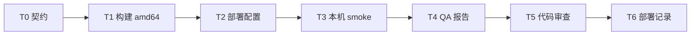

# SUIB-12 任务分解

Issue: `01a061ff-d640-77ec-84c9-5a34c86757a9`  
Delivery dir: `.delivery/01a061ff-d640-77ec-84c9-5a34c86757a9/`  
Feature branch: `agent/full-delivery/suib-12-rebuild-amd64`

---

## DAG

---

## T0 — API/Health 契约冻结

| 字段 | 值 |
|------|-----|
| 角色 | Architect（已完成） |
| deps | — |
| files | `.delivery/.../design.md`, `.delivery/.../stack.yaml` |
| output | T0 smoke 表于 design.md §4 |
| verify_cmd | `test -f .delivery/01a061ff-d640-77ec-84c9-5a34c86757a9/stack.yaml && grep -q t0_contract .delivery/01a061ff-d640-77ec-84c9-5a34c86757a9/stack.yaml` |
| status | done |

**门禁：** Leader 确认 T0 存在后，T1 方可开始。

---

## T1 — 构建 linux/amd64 镜像

| 字段 | 值 |
|------|-----|
| 角色 | Developer-Backend |
| deps | T0 |
| files | `deploy/dockerhub/publish.sh`, `MemoryCore/`, `MemoryProxy/`, `deploy/panel-knowledge-combined/`, `deploy/global-images/.env.example` |
| scope | 从 release 快照构建三件套 amd64 镜像，tag `suib-12-YYYYMMDD` |
| output | 本地镜像 `agentmemory/memory-{core,proxy,hub}:suib-12-*`；build 命令写入 commit message / 后续 deploy.yaml |
| verify_cmd | |
| | `VERSION=suib-12-$(date +%Y%m%d)` |
| | `cd deploy/dockerhub && PUSH=0 LOAD_PLATFORM=linux/amd64 ./publish.sh all` |
| | `docker image inspect agentmemory/memory-core:${VERSION} --format '{{.Architecture}}' \| grep -qx amd64` |
| acceptance | AC1 |

---

## T2 — 部署配置与本机启动

| 字段 | 值 |
|------|-----|
| 角色 | Developer-Backend |
| deps | T1 |
| files | `deploy/global-images/.env`, `deploy/global-images/README.md` |
| scope | 配置 `.env` 指向 T1 本地 tag；本机 `start-all.sh` 拉起三容器 |
| output | 运行中容器；必要时 README 补充 SUIB-12 用法 |
| verify_cmd | |
| | `cd deploy/global-images` |
| | `./verify.sh --skip-llm` |
| | `docker ps --format '{{.Names}} {{.Status}}' \| grep -E 'tdai-memory-core\|tdai-memory-hub\|tdai-proxy' \| grep -v Restarting \| wc -l \| grep -qx 3` |
| acceptance | AC2, AC4 |

**注：** `.env` 含密钥，**不得 commit**；仅 commit `.env.example` 或文档变更。

---

## T3 — Smoke 验证（Dev 自证）

| 字段 | 值 |
|------|-----|
| 角色 | Developer-Backend |
| deps | T2 |
| files | — |
| scope | 按 stack.yaml `t0_contract` 执行 SM-1～SM-5，各 endpoint ≥2 次 |
| output | 命令输出摘要（供 QA 引用） |
| verify_cmd | |
| | `curl -sf http://127.0.0.1:8420/health >/dev/null` |
| | `curl -sf http://127.0.0.1:8125/health >/dev/null` |
| | `curl -sf http://127.0.0.1:8424/health >/dev/null` |
| | `curl -sf http://127.0.0.1:8096/health >/dev/null` |
| | `curl -sf http://127.0.0.1:8424/docs >/dev/null` |
| acceptance | AC3（Dev 预检；QA 正式 sign-off） |

---

## T4 — QA 验收报告

| 字段 | 值 |
|------|-----|
| 角色 | QA Engineer |
| deps | T3 |
| files | `.delivery/01a061ff-d640-77ec-84c9-5a34c86757a9/qa-report.yaml` |
| scope | 对照 requirements AC1–AC5 + T0 smoke，写入 evidence |
| output | `qa-report.yaml`（`blocking: false`） |
| verify_cmd | `test -s .delivery/01a061ff-d640-77ec-84c9-5a34c86757a9/qa-report.yaml && grep -q 'blocking: false' .delivery/01a061ff-d640-77ec-84c9-5a34c86757a9/qa-report.yaml` |
| acceptance | AC5（qa 部分） |

---

## T5 — 代码审查

| 字段 | 值 |
|------|-----|
| 角色 | Reviewer |
| deps | T4 |
| files | PR diff |
| scope | 审查构建/部署脚本与文档改动 |
| output | `.delivery/.../review.md` 首行 `PASS` 或 `FAIL` |
| verify_cmd | `head -1 .delivery/01a061ff-d640-77ec-84c9-5a34c86757a9/review.md \| grep -qx PASS` |
| acceptance | review.md PASS |

**PR：** 标题含 `SUIB-12`，base `release`（merge 需 PO Q6 授权）。

---

## T6 — 部署记录

| 字段 | 值 |
|------|-----|
| 角色 | DevOps |
| deps | T5 |
| files | `.delivery/01a061ff-d640-77ec-84c9-5a34c86757a9/deploy.yaml` |
| scope | 记录镜像 tag、build_cmd、env 摘要、url、health_check、rollback_cmd |
| output | `deploy.yaml` + staging health pass |
| verify_cmd | `test -s .delivery/01a061ff-d640-77ec-84c9-5a34c86757a9/deploy.yaml && grep -q health_check .delivery/01a061ff-d640-77ec-84c9-5a34c86757a9/deploy.yaml` |
| acceptance | AC4, AC5（deploy 部分） |

---

## 并行说明

- T1→T2→T3 串行（同 Dev-Backend，files 重叠于 deploy/）。
- T4 依赖 T3 完成；T5 依赖 T4 `blocking: false`。
- 无 Frontend 任务。

---

## Leader 下一动作

T0 已就绪 → 派 **Developer-Backend** 执行 T1（可与 T2/T3 连续，同一 Dev 完成 BUILD 三段）。
