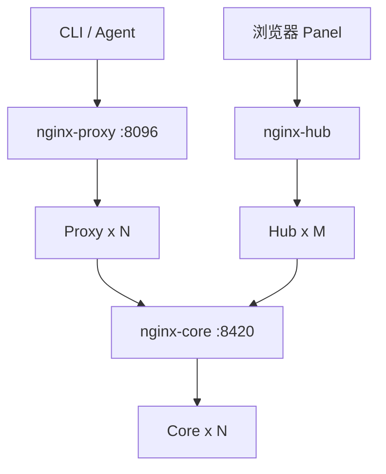
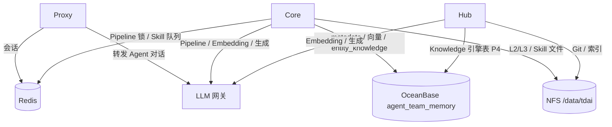

# 自托管高可用技术架构（OceanBase 4.4.2 + Redis）

> **分支：** `feat/selfhosted-ha-oceanbase`  
> **方案说明：** [PROPOSAL.md](./PROPOSAL.md)（现状、目标、阶段划分）  
> **实施计划：** [2026-08-26-selfhosted-ha-oceanbase.md](../../docs/superpowers/plans/2026-08-26-selfhosted-ha-oceanbase.md)  
> **审查报告：** [REVIEW.md](./REVIEW.md)

本文面向 **研发与运维**，描述 selfhosted-ha **目标架构**、数据分层、配置与落地约束；与 PROPOSAL 不一致时以 PROPOSAL 为准。

---

## 1. 设计目标

与 [PROPOSAL §1.2](./PROPOSAL.md#12-建设目标) 一致：

| 目标 | 技术含义 |
|------|----------|
| **应用水平扩展** | Proxy / Core / Hub 均可 `replicas: N`，前接 nginx LB |
| **组件公司化** | OceanBase 4.4.2（MySQL 租户）+ Redis + NFS；**不引入** MongoDB / TCVDB / COS / PostgreSQL |
| **部署形态** | 一期 Docker Compose 多副本验证 → 二期 K8s |
| **单 instance 业务** | 固定 `instance_id=default`，单库 `agent_team_memory`；多 Team 靠 `team_id` 等行级字段 |

新增 **`deployMode: selfhosted`**（二开），存储栈自洽，不依赖 `src/integrations/` 私有子模块。

---

## 2. 现状与目标

### 2.1 现网（Standalone 多实例分片）

见 [PROPOSAL §2.6](./PROPOSAL.md#26-公司当前部署形态)：

| 项 | 现网 |
|----|------|
| Core | 每套 `deployMode: standalone`，SQLite + 本地 Volume |
| 拓扑 | **1 Hub** + **N 组 Proxy–Core**（1:1） |
| instance | 每组独立 `serviceId`；Hub `metadata-instances.json` 注册多 instance |
| 扩容 | 新业务线 ≈ **再部署一套 Proxy + Core** |
| **不是** | Service 模式；也不是官方「单 Core 集群 + 请求头路由」 |

### 2.2 目标（selfhosted-ha）

| 维度 | 现网分片 | 目标 |
|------|----------|------|
| Core 副本 | 每套 Core **仅 1** | 同一 instance 下 **Core × N** |
| 存储 | 每 Core 独立 SQLite/盘 | **共享** OB + Redis + NFS |
| instance | 多个 `serviceId` | **固定 `default`**（本期） |
| Panel | Hub 管多 instance | Hub 连 **单一** nginx-core |
| 扩容 | 加 Proxy+Core 套数 | 加 **副本**，不加库 |

### 2.3 与官方 Service 的区别

| | 官方 Service | selfhosted-ha |
|--|-------------|---------------|
| `deployMode` | `service` | **`selfhosted`**（新增） |
| metadata | MongoDB | OB `meta_*` |
| 向量 | TCVDB | OB `VECTOR` + hybrid |
| 文件 | COS | NFS `/data/tdai` |
| 多 instance | 单集群内路由 | **本期不做**；仅 `default` |

---

## 3. 目标拓扑

### 3.1 请求与负载均衡



**约束：** Proxy / Hub 配置中 Core 地址 **必须** 指向 `http://nginx-core:8420`，禁止写单个 `memory-core` 容器名。

### 3.2 基础设施依赖



### 3.3 服务依赖矩阵

|  | Redis | OceanBase | 共享文件 | LLM | 依赖应用 |
|--|:-----:|:---------:|:--------:|:---:|:--------|
| **Proxy** | ✅ 必须 | — | — | ✅ | Core（nginx-core） |
| **Core** | ✅ 必须 | ✅ 必须 | ✅ 必须 | ✅ | — |
| **Hub** | ✅ 建议 | ✅ P4 后 | ✅ 必须 | ✅ | Core（Panel） |

### 3.4 首期副本建议

| 服务 | P1 | P3 后 | P4 后 | 说明 |
|------|-----|-------|-------|------|
| proxy | **2** | 2 | N | 最先扩；会话已在 Redis |
| core | 1 | **2** | N | P3 前禁止 ×2 |
| hub | 1 | 1 | **2** | P4 前禁止 ×2 |
| nginx-* | 1 | 1 | 1 | 或 K8s Ingress 替代 |
| OB / Redis | — | 公司托管 | — | compose **不部署** OB |

---

## 4. deployMode: selfhosted

### 4.1 代码侧变更（摘要）

| 项 | 现状 | 目标 |
|----|------|------|
| `DeployMode` | `standalone` \| `service` | 增加 **`selfhosted`** |
| Metadata | SQLite / MongoDB | **`mysql`** → OB |
| Memory / Skill store | `sqlite` / `tcvdb` | **`obvector`** |
| `stateBackend` | standalone 默认 `local` | selfhosted 默认 **`redis`** |
| `instanceId` | — | 固定 **`default`**，adapter 不切库 |

### 4.2 与 Standalone / Service 的配置对照

```yaml
# 目标 Core 配置（tdai-gateway.yaml 摘要）
deployMode: selfhosted
stateBackend: redis

data:
  baseDir: /data/tdai/core

memory:
  storeBackend: obvector
  recall:
    strategy: hybrid          # OB DBMS_HYBRID_SEARCH

metadata:
  backend: mysql
  mysql:
    database: agent_team_memory

skill:
  storeBackend: obvector
  extraction:
    queue:
      backend: redis
```

环境变量摘要见 [§9](#9-配置与环境变量)。

---

## 5. OceanBase 角色

OB **一个集群、两种能力**（MySQL 租户 + 向量）：

```text
OceanBase 4.4.2（MySQL 兼容租户）
├── 普通关系表（MySQL 语法）     → meta_*、knowledge_*（Hub）
└── VECTOR 列 + 向量/全文索引     → l0/l1_*、skill_*
    └── DBMS_HYBRID_SEARCH       → hybrid recall（全文 + 向量 RRF）
```

| 概念 | 含义 |
|------|------|
| 驱动 | `mysql2/promise` 连接池 |
| 向量 | `VECTOR(n)`、`VECTOR INDEX`（HNSW）、`FULLTEXT INDEX` |
| Hybrid | `DBMS_HYBRID_SEARCH.SEARCH`；`_source` 必须指定，避免返回 VECTOR 列 |
| 版本 | **4.4.2**；库 **`agent_team_memory`**；utf8mb4 / utf8mb4_general_ci |

**禁止：** compose 内自管 OB；**禁止** OB 数据目录挂 NFS。

---

## 6. 数据分层

与 [PROPOSAL §6](./PROPOSAL.md#六存储分层与组件替换)、[REVIEW §2](./REVIEW.md#2-数据分层审查后定稿) 一致：

```text
┌─────────────────────────────────────────────────────────────────┐
│ OceanBase  agent_team_memory（单库，所有 Core/Hub 副本共用）      │
├─────────────────────────────────────────────────────────────────┤
│ P2  IMetadataStore（原 SQLite metadata / MongoDB）               │
│     meta_users, meta_teams, meta_user_keys, meta_agents, ...   │
├─────────────────────────────────────────────────────────────────┤
│ P3  IMemoryStore + ISkillStore（原 SQLite vectors.db）           │
│     l0_*, l1_* + VECTOR/FULLTEXT                               │
│     skill_* + VECTOR                                           │
│     entity_knowledge ← Core Knowledge 注册表（非 Hub 引擎库）     │
│     entity 镜像、audit、prompts 等                              │
├─────────────────────────────────────────────────────────────────┤
│ P4  Hub 引擎元数据（原 knowledge.db / Drizzle SQLite）          │
│     knowledge_wiki, knowledge_code_graph, llm_binding, ...    │
└─────────────────────────────────────────────────────────────────┘

/data/tdai/core/          ← L2/L3 jsonl、Skill 资源（Core，NFS）
/data/tdai/hub/knowledge/ ← Git clone、Wiki/CodeGraph 索引（Hub，NFS）

Redis                     ← Proxy 会话、Core Pipeline 锁/Skill 队列、Hub 构建锁
```

**易混点：**

- **Core `entity_knowledge`**（Panel 填 `service_url`）→ **P3**，随向量 store 迁入 OB。
- **Hub `knowledge.db`**（Wiki/CodeGraph 任务表）→ **P4**，Drizzle 改 MySQL 驱动。

---

## 7. 文件存储

```text
/data/tdai/                          # 根；整树 eventual 同一 NFS export
├── core/                            # TDAI_DATA_DIR — L2/L3、Skill 文件
├── hub/
│   └── knowledge/                   # KNOWLEDGE_DATA_DIR — Git、索引
└── backup/                          # 备份脚本输出（可选）
```

- 多 Core / 多 Hub 副本 **必须** 挂载 **同一** 共享路径。
- 从本机盘切 NFS：**仅改 mount 源**，容器内路径不变（P5）。

---

## 8. 向量与 Hybrid 检索

### 8.1 表结构要点

Hybrid 检索表须 **HEAP** 组织（示例，维度以 embedding 模型为准）：

```sql
CREATE TABLE l1_records (
  record_id   VARCHAR(64) PRIMARY KEY,
  team_id     VARCHAR(64) NOT NULL,
  agent_id    VARCHAR(64),
  user_id     VARCHAR(64),
  content     TEXT,
  embedding   VECTOR(1536),
  updated_at  BIGINT,
  FULLTEXT INDEX ft_content (content),
  VECTOR INDEX idx_embedding (embedding)
    WITH (distance=l2, type=hnsw_sq, lib=vsag)
) ORGANIZATION HEAP;
```

### 8.2 检索方式

| 场景 | 实现 |
|------|------|
| 纯向量 | KNN / `DBMS_HYBRID_SEARCH` 仅 knn 段 |
| Hybrid（默认） | `DBMS_HYBRID_SEARCH`：全文 + knn + RRF |
| 租户过滤 | SQL `WHERE team_id = ?` 或 knn.filter |

### 8.3 迁移注意

- SQLite vec0 使用 **cosine**；OB 索引 `distance` 须与模型一致，否则需 **重算 embedding**。
- 中文 FULLTEXT 效果需 POC；可降级 `recall.strategy: vector`。
- 启动时校验 `embedding_meta` 与 DDL `VECTOR(n)` 维度一致。

---

## 9. 配置与环境变量

```bash
# OceanBase（公司实例，典型 2881）
TDAI_OB_URI=mysql://<user>:<pass>@<host>:2881/agent_team_memory?charset=utf8mb4
TDAI_OB_DATABASE=agent_team_memory

# 部署模式与单 instance
TDAI_DEPLOY_MODE=selfhosted
TDAI_INSTANCE_ID=default

# Redis
STATE_BACKEND=redis
REDIS_HOST=...
REDIS_PASSWORD=...
REDIS_KEY_PREFIX=tdai_memory

# 文件
TDAI_DATA_DIR=/data/tdai/core
KNOWLEDGE_DATA_DIR=/data/tdai/hub/knowledge

# 副本（compose / K8s）
PROXY_REPLICAS=2
CORE_REPLICAS=2      # P3 前保持 1
HUB_REPLICAS=1       # P4 前保持 1
```

**Proxy / Hub：** `serviceId: default`；`tdai.endpoint` / `REMOTE_INSTANCE_URL` → `nginx-core:8420`。

**保留 internal-team 能力：** per-sk-mem MaaS、HTTP Git、`MEMORY_CORE_GATEWAY_API_KEY` 留空策略等，在新 compose 模板中延续。

---

## 10. 组件替换清单

| 组件 | 现网（Standalone 分片内） | selfhosted 目标 | 可扩副本 |
|------|---------------------------|-----------------|----------|
| Proxy | 单实例 + Redis | nginx + ×N | P1 起 ✅ |
| Core metadata | SQLite | OB `meta_*` | P2 起 ✅ |
| Core 向量 / Skill | SQLite vectors.db | OB VECTOR | **P3 起 ✅** |
| Core 文件 | 本地 Volume | `/data/tdai/core` → NFS | P5 |
| Core 锁/队列 | local | Redis | P3 |
| Core Knowledge 注册表 | SQLite `entity_knowledge` | OB（P3） | P3 |
| Hub 引擎 DB | SQLite knowledge.db | OB `knowledge_*`（P4） | **P4 起 ✅** |
| Hub 文件 | 本地 Volume | `/data/tdai/hub` → NFS | P5 |
| LLM | 公司网关 | 不变 | — |

---

## 11. 水平扩展约束

| 阶段 | Proxy | Core | Hub |
|------|-------|------|-----|
| P1 完成 | ×2 ✅ | ×1 | ×1 |
| P3 完成 | ×N | **×2 ✅** | ×1 |
| P4 完成 | ×N | ×N | **×2 ✅** |
| P5 NFS | 共享文件就绪 | 同上 | 同上 |

**原则：** 加应用副本 **不增加** OB 库数量；全体副本共用 `TDAI_OB_URI` 与 NFS。

---

## 12. 从现网迁移

selfhosted-ha **新栈与现网分片并行**，审批通过后再切流量；不修改 `deploy/internal-team`。

| 步骤 | 说明 |
|------|------|
| **并行运行** | 新 compose 独立域名/端口；`instance_id=default` 新库 |
| **数据迁移** | 按业务选 **试点 instance**：`migrate-sqlite-to-oceanbase` 分 P2（metadata）、P3（vectors + entity_knowledge） |
| **多 instance 合并** | 若需把多套分片并入单库：需 **单独立项**（Team 冲突、ID 映射）；**不在本期范围** |
| **Hub** | 新 Hub 仅注册 `default` → nginx-core；P4 后迁 knowledge 数据 |
| **切流** | Proxy 入口切 nginx-proxy；旧 Proxy–Core 对下线前备份 Volume |

现网「加业务线 = 加 Proxy+Core」的运维习惯，在目标态改为 **调 replicas + 共享 OB**。

---

## 13. 分阶段落地（摘要）

与 [PROPOSAL §8.4](./PROPOSAL.md#84-研发分期与部署对应) 一致；任务明细见 [实施计划](../../docs/superpowers/plans/2026-08-26-selfhosted-ha-oceanbase.md)。

| 阶段 | 研发 | 部署能力 |
|------|------|----------|
| **P0** | compose / nginx / 文档骨架 | 单副本跑通 |
| **P1** | Proxy 多副本 | Proxy×2 + Redis |
| **P2** | metadata → OB | Core×1，OB 元数据 |
| **P3** | 向量 + Skill + Redis 锁 | **Core×2** |
| **P4** | Hub knowledge.db → OB | **Hub×2** |
| **P5** | NFS 切换 | 多副本共享文件 |
| **P6** | K8s manifests | 生产 K8s |

**过渡态（P1～P3）：** Proxy 已双副本，Core 仍 SQLite 单副本，不影响现网分片继续运行。

---

## 14. DBA 对接

| 项 | 要求 |
|----|------|
| 版本 | **4.4.2** |
| 租户 | MySQL 兼容 |
| 库 | **`agent_team_memory`**（utf8mb4 / utf8mb4_general_ci） |
| 权限 | DDL、`DBMS_HYBRID_SEARCH` |
| 向量 | 确认集群向量内存参数；Embedding 维度与 DDL 一致 |

清单详见 [README.md §与公司 OB 对接](./README.md#与公司-ob-对接p0-文档化)。

---

## 15. 风险与约束

| 项 | 缓解 |
|----|------|
| P3 移植面大 | 按 `sqlite.ts` checklist；Knowledge 注册表算 P3 |
| P3 前 Core×2 | **强制** core replicas=1 |
| P4 前 Hub×2 | **强制** hub replicas=1 |
| 向量维度不一致 | 启动校验 `embedding_meta` |
| 中文 hybrid 弱 | POC；可降级纯向量 |
| NFS 并发写 | Pipeline 锁走 Redis |

完整矩阵见 [REVIEW §6](./REVIEW.md#6-风险矩阵按优先级)。

---

## 16. 仓库目录（规划）

```text
deploy/selfhosted-ha/
├── PROPOSAL.md              ← 建设方案说明
├── ARCHITECTURE.md          ← 本文
├── REVIEW.md
├── README.md
├── docker-compose.yml       ← P0 起
├── nginx/
│   ├── proxy.conf
│   ├── core.conf
│   └── hub.conf
├── templates/
│   ├── tdai-gateway.yaml
│   └── proxy-config.yaml
├── up.sh
└── .env.example

docs/superpowers/plans/
└── 2026-08-26-selfhosted-ha-oceanbase.md   ← 研发任务拆解
```

---

## 17. 一句话

**在自托管路线上新增 `deployMode: selfhosted`：单 instance `default`、单库 `agent_team_memory`、Redis 锁与会话、NFS 文件；应用经 nginx 水平扩展；用 OceanBase 同时承接 metadata 与向量，替代现网多套 Standalone SQLite 分片——不采用官方 Service 的 MongoDB/TCVDB/COS。**
