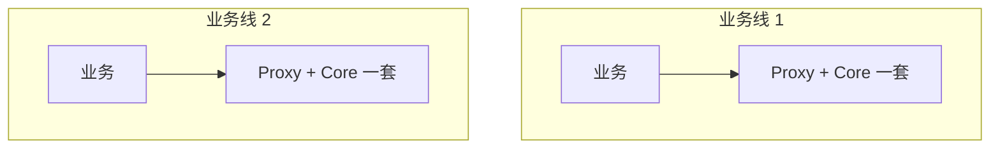
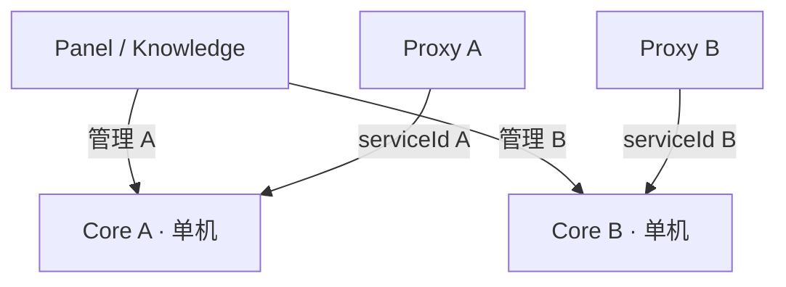
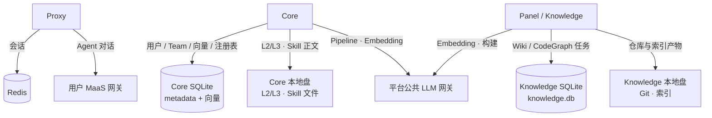
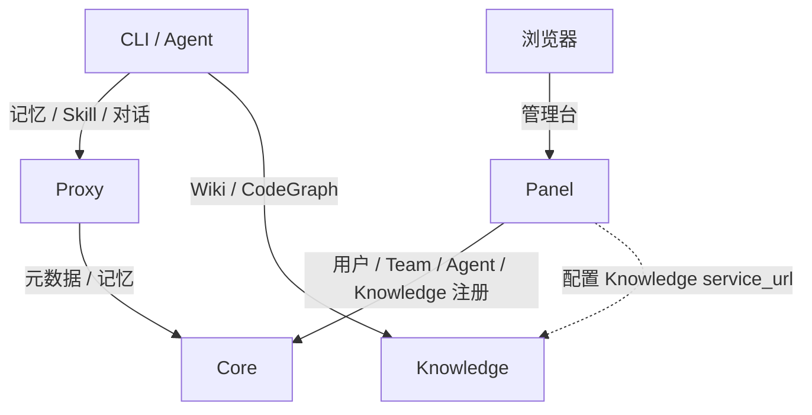
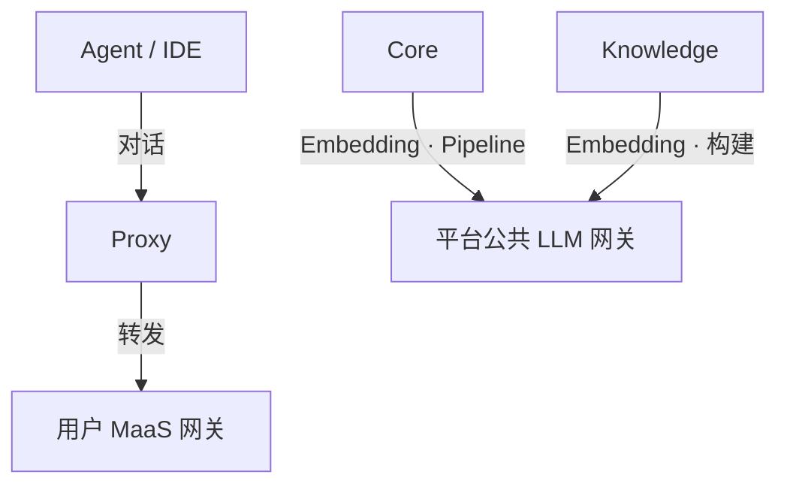
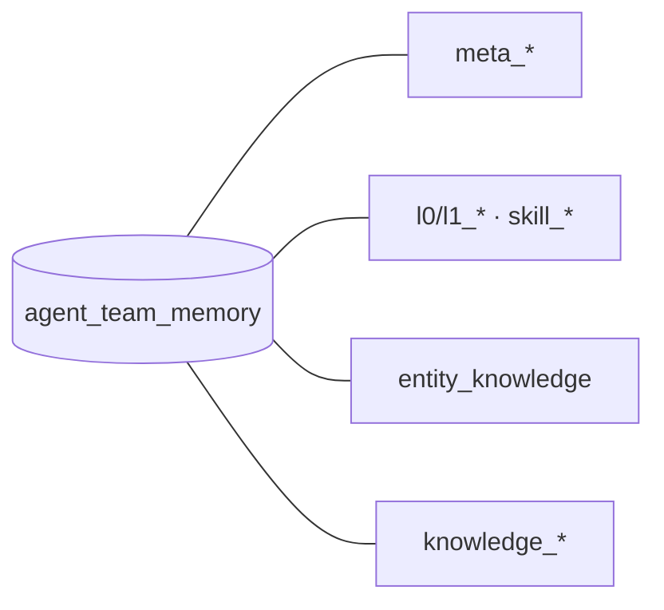
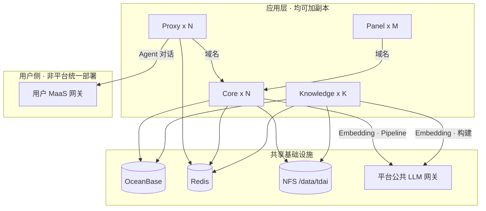

# Agent Team Memory 自托管高可用方案说明

## 一、建设背景与目标

### 1.1 背景

Agent Team Memory（以下简称 **ATM**）是 Agent 的 **记忆与知识平台**：Agent 通过 **接入代理（Proxy）** 使用记忆与对话能力，**记忆核心（Core）** 存用户与记忆数据，**管理控制台（Panel）** 做注册与管理，**知识服务（Knowledge）** 提供 Wiki / 代码图谱。

当前每增加一条业务线，往往 **再部署一套 Proxy + Core**；单套 **不能加机器扩容**，数据也落在各自容器里，运维成本高。腾讯云官方方案又依赖 MongoDB、云向量库、对象存储等，**不符合**公司中间件要求。

因此建设 **自托管高可用方案（selfhosted-ha）**：统一到公司 **OceanBase、Redis、共享文件存储**，业务增长时 **给各模块加副本** 即可；管理台与知识服务也可 **单独发布、单独扩容**。

### 1.2 建设目标

| 目标 | 说明 |
|------|------|
| **应用水平扩展** | Proxy、Core、Panel、Knowledge 均可按负载增加副本，前接负载均衡 |
| **组件公司化替换** | 用 **OceanBase 4.4.2**、**Redis**、**共享文件存储（NFS）** 替代 MongoDB / TCVDB / COS |
| **统一平台、模块可独立运维** | 全公司共用 **一套 ATM**（一套库、一套共享目录）；管理控制台与知识服务 **分开发布、分开扩缩**，便于接入公司流水线；多团队在平台内隔离，不必再拆多套互不共享的记忆环境 |

---

## 二、现状

### 2.1 部署拓扑

当前采用 **1 个管理面（Panel，常与 Knowledge 合并）+ N 组 Proxy–Core**（每组 1 Proxy 固定连 1 台单机 Core）：

| 项目 | 说明 |
|------|------|
| **每套 Core** | `deployMode: standalone`；独立 SQLite + 本地 Volume，**单机、不能加副本** |
| **拓扑** | **1 个管理入口**（Panel，常与 Knowledge 同机合并）+ **N 组 Proxy–Core** |
| **分组方式** | 每组 Proxy 配独立 `serviceId`；Panel 用 `metadata-instances.json` 指向不同 Core |
| **扩容方式** | 新业务线 ≈ **再部署一套 Proxy + Core**；无法在现有 Core 上直接加副本 |
| **Panel 与 Core** | Panel **无**独立用户库；用户 / Team / Agent 管理面数据 **全部走 Core** |

> 这是 **物理上多套单机** 叠在一起，**不是** 官方 Service 那种「一套 Core 集群 + 共享云存储」。Panel 与 Knowledge 现状多为 **合并镜像**，目标态拆成独立服务。

### 2.2 存什么、放哪

每套 Core / Panel+Knowledge 各自一份本地数据：

| 数据 | 存储 | 说明 |
|------|------|------|
| 用户 / Team / API Key | Core **SQLite**（metadata） | 单文件，随容器 Volume |
| L0/L1 向量、Skill 向量 | Core **SQLite**（vectors.db） | 含 vec0 向量索引 |
| Knowledge **注册表** | Core vectors.db 内 `entity_knowledge` | service_url 等，非 Knowledge 引擎库 |
| L2/L3、Skill 正文 | Core **本地目录** | jsonl / md / 资源文件 |
| Wiki/CodeGraph **任务状态** | Knowledge **SQLite**（knowledge.db） | 同步进度、审计 |
| Git 仓库、索引产物 | Knowledge **本地目录** | 不进 SQLite |
| 会话 | **Redis** | Proxy 使用 |
| Pipeline 锁、Skill 队列 | 默认 **local**（进程内） | 多 Core 副本会冲突 |
| Agent 对话算力 | **用户 MaaS 网关** | 经 Proxy，按身份 Key 绑定 |
| 服务内部算力 | **平台公共 LLM 网关** | Core Pipeline / Embedding；Knowledge 构建 |

### 2.3 主要瓶颈

| 瓶颈 | 原因 |
|------|------|
| **Core / Knowledge 不能加副本** | SQLite + 进程内锁，多进程写会冲突 |
| **文件不共享** | L2/L3、Git 在容器 Volume，跨节点无法共用 |
| **扩业务线只能加「套数」** | 再部署一套 Proxy–Core，运维与数据面成倍增加 |
| **无法直接用官方 Service** | 依赖 MongoDB / TCVDB / COS 与私有 integrations，公司环境不满足 |

### 2.4 与官方两种模式的关系（对照）

产品代码里 `deployMode` 只有两种官方形态；**当前部署属于 Standalone（多套物理叠加）**，不是 Service。

| 维度 | **Standalone** | **Service（官方云模式）** | **当前部署** |
|------|----------------|---------------------------|--------------|
| 配置 | `deployMode: standalone` | `deployMode: service` | Standalone |
| metadata | SQLite | MongoDB | SQLite |
| 向量 | SQLite | TCVDB | SQLite |
| 文件 | 本地盘 | COS | 本地盘 |
| Core 多副本 | ❌ | ✅（共享远程存储） | ❌（每套单机） |
| 典型依赖 | LLM；可选 Redis | LLM + Mongo + TCVDB + COS + Redis | LLM + Redis |

> **为何不改用 Service：** 缺腾讯云组件与私有子模块；selfhosted-ha 在自托管路线上用 OB + Redis + NFS 达成「可扩副本」。

---

## 三、设计方案

### 3.1 方案概要

本章说明目标架构下的 **系统关系、部署形态与改造项**，落实第一章建设目标。核心设计选择如下：

| 维度 | 选择 |
|------|------|
| **存储** | 全公司共用 OB 库 `agent_team_memory`、NFS `/data/tdai`；替代现状多套 SQLite / 本地盘 |
| **模块** | Proxy、Core、Panel、Knowledge 四模块；Panel 与 Knowledge 从合并镜像 **拆分** |
| **发布** | 各模块独立制品，经 **公司流水线** 构建发布，域名接入 |
| **扩展** | 各模块可按负载 **加副本**，共享 OB / Redis / NFS |
| **算力** | Agent 对话经 Proxy 走 **用户 MaaS 网关**；Core / Knowledge 内部 Embedding、构建等走 **平台公共网关** |
| **实现路径** | Standalone 接线 + OB / Redis 适配；**不走**官方 Service |

产品侧固定环境标识 **`default`**。

### 3.2 系统架构

**调用关系**

| 路径 | 说明 |
|------|------|
| Agent → Proxy → Core | 记忆注入、Skill、会话；会话态在 Redis |
| 浏览器 → Panel → Core | 管理面；Panel **无**独立用户库 |
| Agent → Knowledge | Wiki / CodeGraph；引擎表在 OB，Git/索引在 NFS |
| Panel → Knowledge | Panel 登记 Knowledge 时写入 Core 注册表（含 `service_url` 指向 Knowledge） |

**算力与网关**

Agent **对话**走 Proxy，可按用户绑定 **各自的** 公司 MaaS 网关 Key（客户端只配 Proxy 地址与身份 Key）。  
Core、Knowledge 等 **服务内部任务**（记忆 Pipeline、向量 Embedding、Wiki / CodeGraph 构建等）统一走 **平台公共** LLM 网关，与用户个人 Key 无关。

| 场景 | 算力 | 说明 |
|------|------|------|
| Agent 对话（经 Proxy 转发） | **用户自有** | 每人 / 每把身份 Key 可绑不同 MaaS Key |
| Core 记忆 Pipeline、Embedding | **平台公共** | 服务级配置；写入向量、记忆抽取等 |
| Knowledge Wiki / CodeGraph 构建 | **平台公共** | 服务级配置；索引与 Embedding |
| Panel 管理面（如有 LLM 调用） | **平台公共** | 与用户对话路径无关 |

**数据落点**

| 数据 | 目标存储 | 使用方 |
|------|----------|--------|
| 用户 / Team / API Key | OB `meta_*` | Core（Panel 经 API 读写） |
| L0/L1、Skill 向量 | OB VECTOR | Core |
| Knowledge 注册表（`service_url` 等） | OB `entity_knowledge` | Core |
| Wiki / CodeGraph 引擎表 | OB `knowledge_*` | Knowledge |
| L2/L3、Skill 文件 | NFS `/data/tdai/core` | Core |
| Git 仓库、索引产物 | NFS `/data/tdai/hub/knowledge` | Knowledge；路径中 `hub` 为代码目录约定，对应 Knowledge 模块 |
| 会话 / 锁 / 队列 | Redis | Proxy、Core、Knowledge |

**不引入：** MongoDB、TCVDB、COS、PostgreSQL、独立向量库。

### 3.3 部署架构

目标态将 ATM 拆为以下模块，分别构建、发布与扩缩（管理控制台与知识服务不再打成同一个合并包）。容器编排与对外接入由 **公司流水线 / 平台** 负责，对外以 **域名** 访问，本方案不单独建设接入层。

| 模块 | 职责 | 访问（域名示例） | 交付物 |
|------|------|------------------|--------|
| **接入代理 Proxy** | Agent/IDE 入口；会话、记忆注入；对话转发 | `proxy.<域>` | `memory-proxy` |
| **记忆核心 Core** | 记忆 L0–L3、Skill、元数据 API | `core.<域>`（内网） | `memory-core` |
| **管理控制台 Panel** | 用户 / Team / Agent / Knowledge 注册与管理 | `panel.<域>` | `memory-panel` |
| **知识服务 Knowledge** | Wiki / CodeGraph 引擎 API | `knowledge.<域>` | `memory-knowledge` |

**部署约定**

- 各模块走公司流水线单独构建与发布；配置用环境变量 / ConfigMap；对外暴露由平台挂域名与负载均衡。
- Proxy / Panel 访问 Core **走 Core 域名**，不直连单个 Core 实例。
- Knowledge 对外域名路径须含 API 前缀（如 `/v3`），供 Agent / Panel 配置 `service_url`。
- OceanBase、Redis、NFS 由中间件 / 基础设施提供，不随应用发布扩缩。

**水平扩展**

| 模块 | 扩展方式 | 前提 |
|------|----------|------|
| **Proxy** | 加副本（域名侧负载均衡） | Redis 会话 |
| **Core** | 加副本 | metadata/向量已上 OB；Redis 锁；NFS |
| **Panel** | 加副本 | 无本地业务库（状态在 Core） |
| **Knowledge** | 加副本 | 引擎表已上 OB；NFS；构建锁用 Redis |

加副本 **不增加** OB 库数量；各模块共用同一 OB 连接与 NFS。验证期建议各模块 2 实例（对应存储改造完成后）。

**部署形态**

| 形态 | 用途 | 要点 |
|------|------|------|
| **联调 / 预发** | 验证存储与多副本 | 各模块分别发布；连公司 OB / Redis；共享盘或 NFS |
| **生产** | 正式环境（本期不含） | 需申请正式中间件资源；各模块独立制品与副本 |

容器与接入层由公司流水线承接；本方案交付各模块镜像与配置约定。

### 3.4 关键改造点

| # | 改造项 | 说明 |
|---|--------|------|
| 1 | 适配公司流水线 | 各模块构建、发布、环境变量 / ConfigMap、域名暴露等接入公司平台 |
| 2 | 管理控制台与知识服务拆分 | 分开发布；按模块扩缩 |
| 3 | Core metadata → OB | `IMetadataStore` MySQL/OB 适配 |
| 4 | Core 向量 / Skill → OB | `IMemoryStore` / `ISkillStore` + VECTOR；含 `entity_knowledge` |
| 5 | Core 锁 / 队列 → Redis | 多 Core 实例并行的前提 |
| 6 | Knowledge 引擎库 → OB | 原 `knowledge.db`；支持知识服务多实例 |
| 7 | 文件进 NFS | Core 与 Knowledge 共享约定路径 |
| 8 | 部署模式配置 | 建议 `selfhosted`（或 Standalone 接线 + OB/Redis）；**不**改官方 Service |

## 四、实施路径

### 4.1 本期范围

| 范围 | 说明 |
|------|------|
| **本期** | 在公司流水线 **测试环境** 完成部署与验收 |
| **生产环境** | 需申请正式 OceanBase、Redis、NFS，本期不包含 |

### 4.2 主要工作

| 工作 | 做什么 | 做到什么程度 |
|------|--------|--------------|
| **接入公司流水线** | 官方 ATM 源码纳入公司构建 / 发布流程；各模块在测试环境以域名对外 | 部署链路打通 |
| **架构改造与验证** | 按关键改造点完成存储与模块改造；对接公司测试用 OceanBase、Redis、NFS 联调 | 目标存储、多副本、Panel / Knowledge 拆分等验证通过 |
| **测试环境交付** | 改造后的代码经流水线发布到测试环境，按目标部署架构运行 | 测试环境全链路可用 |

接入流水线与架构改造 **可同时进行**，具体顺序由研发按依赖安排。对接公司组件随各改造项一并验证，不单独拆步。

### 4.3 工期

| 阶段 | 工期 |
|------|------|
| **测试环境**（本期） | 约 **1～2 周** |
| **生产环境**（如需） | 约 **2 周** |

### 4.4 里程碑

| 里程碑 | 标志 |
|--------|------|
| **部署链路可用** | 测试环境经流水线可访问 ATM，基本业务链路可演示 |
| **存储改造就绪** | metadata、向量 / Skill、Knowledge 引擎库等已迁 OB；锁 / 会话走 Redis；文件走 NFS |
| **测试环境达标** | 各模块可扩副本，全链路在测试环境稳定运行 |

---

## 五、风险与对策（摘要）

| 风险 | 对策 |
|------|------|
| Core 向量适配工作量大 | 分阶段交付；向量迁 OB 完成前 Core 保持单副本 |
| 向量维度与模型不一致 | 启动校验 + 与 LLM 团队确认 embedding 规格 |
| Knowledge 引擎库未迁 OB 前扩副本 | Knowledge 写库完成前慎扩；Panel 无状态可先扩 |
| NFS 并发写文件 | Pipeline 锁走 Redis；文件路径规范不变 |
| 中文混合检索效果 | OB 4.4.2 POC；可降级纯向量检索 |
