# Agent Team Memory 自托管高可用方案说明

> **文档用途：** 提交领导审阅的建设方案（现状、服务关系、依赖、组件替换、水平扩展与部署路径）  
> **建设分支：** `feat/selfhosted-ha-oceanbase`  
> **范围说明：** 本文描述 **selfhosted-ha** 新部署体系；审批通过后再实施，与现有单机试用环境并行，互不影响。
>
> **飞书文档用法：** 架构图均为 **Mermaid 流程图**。粘贴到飞书时：在代码块语言选 **`Mermaid`**（若文档支持），或先用 [mermaid.live](https://mermaid.live) 导出 PNG/SVG 再插入飞书。

---

## 一、建设背景与目标

### 1.1 背景

Agent Team Memory（以下简称 **ATM**）基于开源 TencentDB Agent Memory 二开，包含记忆注入 **Proxy**、记忆 **Core**、管理 **Panel** 与 **Knowledge Hub**。产品代码通过 **`deployMode`** 支持 **Standalone** 与 **Service** 两种官方形态（详见 **§2.1**）。公司现网为 **Standalone 多实例分片**（1 Hub + 多套 Proxy–Core，详见 **§2.6**），单套 Core 仍无法水平扩展，且 **不能使用** Service 所依赖的 MongoDB / TCVDB / COS，因此建设 **selfhosted-ha**：在自托管路线上用 **OceanBase + Redis + NFS** 实现可扩展部署。

### 1.2 建设目标

| 目标 | 说明 |
|------|------|
| **应用水平扩展** | Proxy、Core、Hub 均可按负载增加副本，前接负载均衡 |
| **组件公司化替换** | 用 **OceanBase 4.4.2**、**Redis**、**共享文件存储（NFS）** 替代 MongoDB / TCVDB / COS |
| **部署形态可选** | 一期：**单机 Docker 多副本**验证；二期：**Kubernetes** 生产部署 |
| **单实例业务** | 固定 `instance_id=default`，一套库 `agent_team_memory`；多 Team 靠行级字段隔离 |

---

## 二、现状：部署模式、服务与依赖

ATM 在代码里通过 Core 配置项 **`deployMode`** 区分两种官方部署模式。二者 **共用同一套应用**（Proxy、Core、Hub）和 **同一套 HTTP API**，差异主要在 **存什么库、能否多副本、是否多 instance**。

### 2.1 两种部署模式一览

| 维度 | **Standalone（单机自托管）** | **Service（云服务化）** |
|------|------------------------------|-------------------------|
| **配置** | `deployMode: standalone` | `deployMode: service` |
| **设计定位** | 本地开发、Docker 一体化、离线/内网单机 | K8s 多副本、多租户 SaaS、腾讯云托管 |
| **用户/Team/Key（metadata）** | Core **SQLite** 文件 | **MongoDB** |
| **L0/L1 向量、Skill 向量** | Core **SQLite**（vectors.db） | **腾讯云向量库 TCVDB** |
| **L2/L3、Skill 正文文件** | Core **本地磁盘** | **COS 对象存储** |
| **Pipeline 锁、Skill 队列** | 默认 **进程内 local**；可配 Redis | **Redis**（分布式锁 + 队列） |
| **Proxy 会话** | **Redis**（多 Proxy 副本时需要） | **Redis** |
| **Hub Knowledge 引擎库** | Hub **SQLite**（knowledge.db） | 同左（Hub 侧仍为 SQLite 文件） |
| **instance_id** | 通常固定 **`default`** | 请求头 **`x-tdai-service-id`**，可多套并行 |
| **Core 水平扩展** | **不支持**（SQLite + local 锁） | **支持**（共享 TCVDB/COS/Redis） |
| **典型外部依赖** | LLM 网关；可选 Redis | LLM + **MongoDB + TCVDB + COS + Redis** |

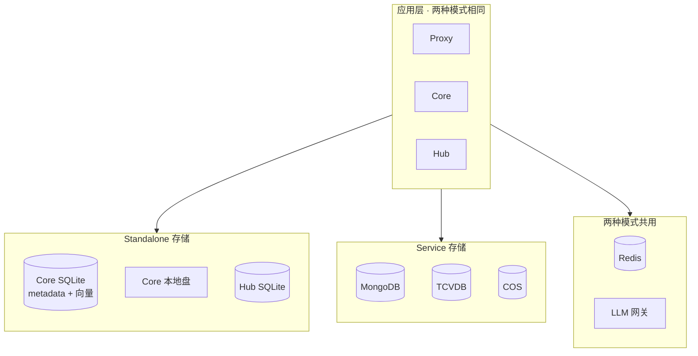

> 读图：应用拓扑不变；**换 deployMode = 换 Core 背后存储**。Standalone 走左侧 SQLite/本地盘，Service 走右侧 MongoDB/TCVDB/COS；两种模式 **不会同时** 使用两套 Core 存储。

### 2.2 应用服务（两种模式共用）

| 服务 | 职责 | 典型端口 |
|------|------|----------|
| **Memory Proxy** | Agent/IDE 入口；会话、记忆注入、转发 LLM | 8096 |
| **Memory Core** | 记忆 L0–L3、Skill、用户/Team/Agent 元数据 API | 8420 |
| **Memory Hub** | Panel 管理台 + Knowledge（Wiki/CodeGraph 引擎） | 8125 / 8424 |
| **Redis** | Proxy 会话；Service 模式下 Core 锁/队列 | 6379 |

### 2.3 服务调用与外部依赖

**应用间调用**（两种模式相同）

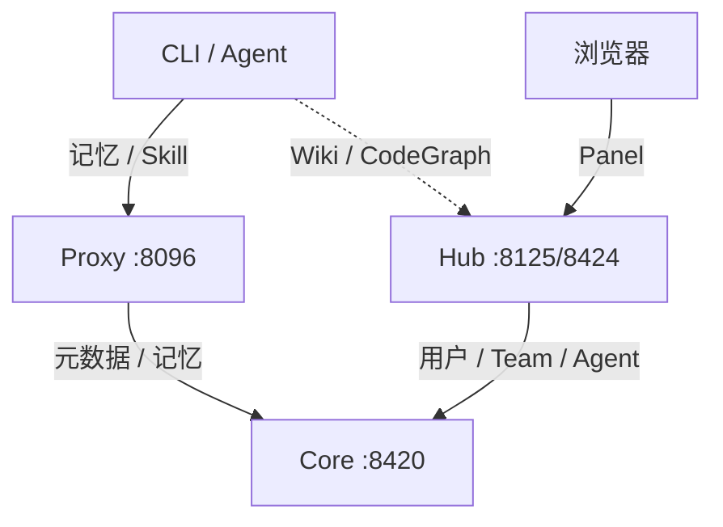

| 调用方 | 目标 | 说明 |
|--------|------|------|
| CLI / Agent | Proxy | 记忆注入、Skill、转发 LLM |
| Proxy | Core | 元数据、L0–L3 记忆 |
| 浏览器 | Hub | Panel 管理界面 |
| Hub | Core | 用户 / Team / Agent（Hub **无**独立用户库） |
| CLI / Agent | Hub | 查询 Wiki / CodeGraph |

**外部依赖**（随 `deployMode` 变化；下图分别列出 **谁连什么、干什么**）

*Standalone*

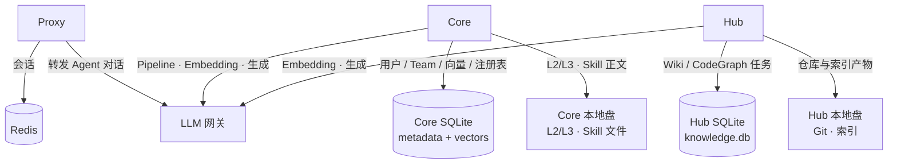

*Service*

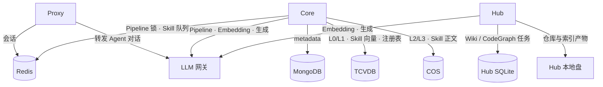

| 组件 | Standalone 依赖 | Service 依赖 | 用途 |
|------|-----------------|--------------|------|
| **Proxy** | Redis、LLM | Redis、LLM | 会话状态；转发 Agent 对话 |
| **Core** | SQLite、本地盘、LLM；（锁默认进程内） | MongoDB、TCVDB、COS、Redis、LLM | 元数据、向量、文件、Pipeline |
| **Hub** | Hub SQLite、本地盘、LLM | 同左 | Wiki/CodeGraph 任务与产物（Hub 不连 Mongo/TCVDB） |

### 2.4 Standalone 模式：存什么、放哪

| 数据 | 存储 | 说明 |
|------|------|------|
| 用户 / Team / API Key | Core **SQLite**（metadata） | 单文件，随容器 Volume |
| L0/L1 向量、Skill 向量 | Core **SQLite**（vectors.db） | 含 vec0 向量索引 |
| Knowledge **注册表** | Core vectors.db 内 `entity_knowledge` | service_url 等，非 Hub 引擎库 |
| L2/L3、Skill 正文 | Core **本地目录** | jsonl / md / 资源文件 |
| Hub Wiki/CodeGraph **任务状态** | Hub **SQLite**（knowledge.db） | 同步进度、审计 |
| Git 仓库、索引产物 | Hub **本地目录** | 不进 SQLite |
| 会话 | **Redis** | Proxy 使用 |
| Pipeline 锁、Skill 队列 | 默认 **local**（进程内） | 多 Core 副本会冲突 |

**特点：** 外部依赖少，**一条命令可起 Core**；但 metadata/向量/Hub 库都在 **单机文件** 里，**Core/Hub 不能安全多副本**。

### 2.5 Service 模式：存什么、放哪

| 数据 | 存储 | 说明 |
|------|------|------|
| 用户 / Team / API Key | **MongoDB** | 按 `instance_id` 分库；Core 启动校验必填 |
| L0/L1 向量、Skill 向量 | **TCVDB** | 远程向量服务；`storeBackend: tcvdb` |
| L2/L3、Skill 正文 | **COS** | 按 instance 路径隔离 |
| Knowledge 注册表 | **TCVDB**（与向量同套 store） | 与 Standalone 逻辑等价，介质不同 |
| Hub 引擎库 / Git 文件 | 仍多为 **Hub 本地 SQLite + 盘** | 全栈部署时与 Standalone 类似 |
| 锁 / 队列 / 会话 | **Redis** | Core 多副本前提 |

**特点：** 为 **多副本、多 instance** 设计；依赖 **腾讯云 MongoDB / TCVDB / COS**（及 Redis），且 Core 需 **`src/integrations/` 私有子模块** 才能完整启动，**不符合**公司「只用 OB + Redis + NFS」约束。

### 2.6 公司当前部署形态

现网采用 **Standalone 多实例分片**——底层仍是 §2.4 的单机 Standalone，**不是** §2.5 的 Service 模式，也**不是**官方「单 Core 集群内按 `x-tdai-service-id` 路由」。

| 项目 | 说明 |
|------|------|
| **每套 Core** | `deployMode: standalone`；独立 SQLite + 本地 Volume，**单机、不可多副本** |
| **拓扑** | **1 个 Hub**（Panel 统一入口）+ **N 组 Proxy–Core**（每组 1 Proxy 固定连 1 Core） |
| **serviceId / instance** | 每组 Proxy 配 **独立 `serviceId`**；Hub 用 `metadata-instances.json` 注册多个 instance，分别指向不同 Core 地址 |
| **扩容方式** | 新业务线 ≈ **再部署一套 Proxy + Core**；无法在现有 Core 上直接加副本 |
| **与 Service 区别** | 虽有多 `serviceId`，但 **未使用** MongoDB / TCVDB / COS，也 **未共享** Core 集群 |

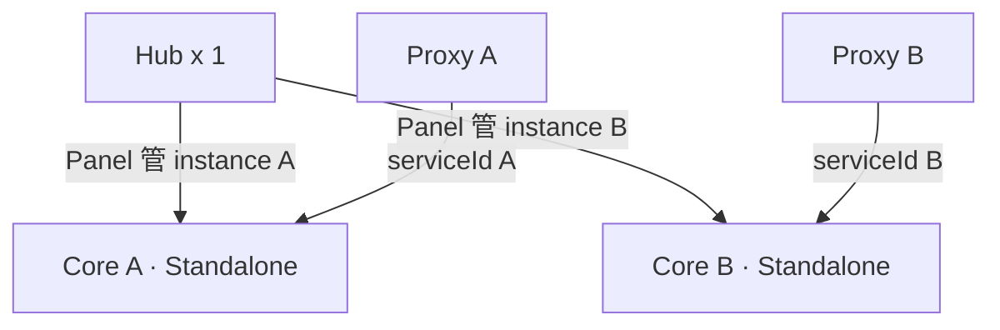

---

## 三、多套 instance 是做什么的？为何本期只做单实例

### 3.1 产品里的 instance 是什么

ATM 代码里有一级概念 **`instance_id`**（HTTP 头 `x-tdai-service-id`，Proxy 路径如 `/claude-code/{instance_id}`）。它表示 **一套独立的「记忆实例」**——不是 Docker 容器副本，而是 **逻辑上的多套并行部署单元**。

下图是 **官方多 instance 架构示意**（本期不做；仅说明概念）：

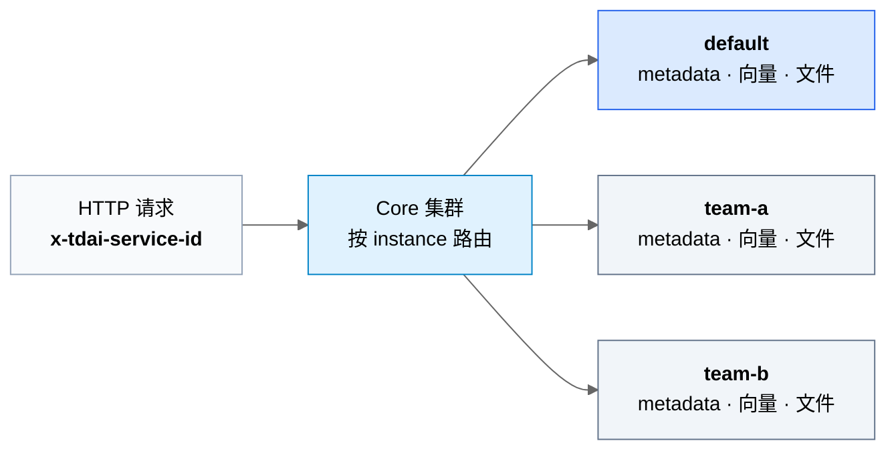

**读图要点：** 一个 instance = 一套独立的 metadata + 向量 + 文件；多套 instance 共用 Core 进程，靠请求头 **切到不同存储**。与 **水平扩展**（同一 instance 下加 Proxy/Core 副本）是不同维度。

### 3.2 多套 instance 解决什么问题

| 场景 | 说明 |
|------|------|
| **多业务线 / 多产品** | 同一套 Core 集群托管多套互不影响的记忆环境（如 A 产品与 B 产品） |
| **强隔离** | 实例间数据、向量、文件完全分开，合规或租户边界清晰 |
| **云 Service 售卖** | 腾讯云版按实例售卖给不同客户，每客户一个 instance |

隔离层级在官方设计里大致为：`instance_id` → `team_id` → `agent_id` → `user_id`。

### 3.3 本期为何只做单实例（`default`）

| 因素 | 说明 |
|------|------|
| **业务需求** | 公司内 **一套 Agent Team Memory 服务** 即可；多 Team、多 Agent 用 **表内 `team_id` 等字段** 隔离，不需要再拆多套 instance |
| **运维简化** | **一个 OB 库** `agent_team_memory`、一条连接串、一套 NFS 目录；扩应用副本 **不加库** |
| **实施成本** | 多 instance 需按请求动态切库/切目录，适配与测试量显著增加 |
| **与水平扩展不矛盾** | **水平扩展** = 同一 instance 下 Proxy/Core/Hub **加副本**；**多 instance** = 多套逻辑环境并行，是不同维度 |

**结论：** 本期固定 **`instance_id = default`**，全力做 **组件替换 + 服务水平扩展**；若未来确有「多套记忆环境并行」需求，再单独立项做多 instance。

**本期单 instance 示意（与上图对比）：**

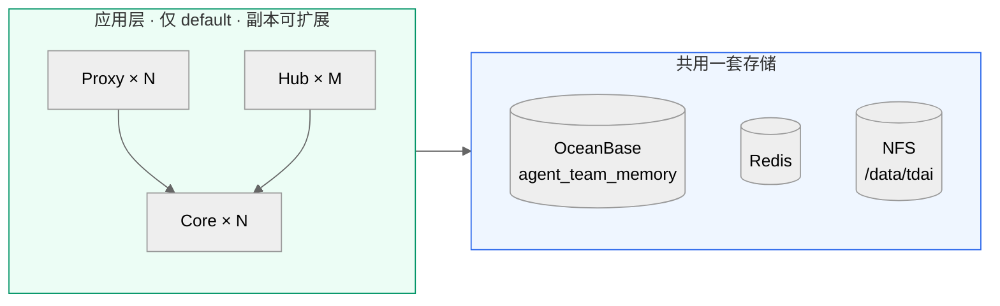

---

## 四、目标系统组成（selfhosted-ha）

### 4.1 应用服务（需水平扩展）

| 服务 | 职责 | 对外端口（示例） | 扩展前提 |
|------|------|------------------|----------|
| **Memory Proxy** | Agent/IDE 流量入口；会话、记忆注入、转发 LLM | 8096 | 依赖 **Redis** 存会话 |
| **Memory Core** | 记忆读写、Skill、用户/Team 元数据 API | 8420（内网） | 依赖 **OB + Redis + 共享文件** |
| **Memory Hub** | Panel 管理台 + Knowledge（Wiki/CodeGraph） | 8125 / 8424 | Hub 多副本需 **OB + 共享 knowledge 目录** |

### 4.2 接入层（负载均衡）

| 组件 | 作用 |
|------|------|
| **nginx-proxy** | Proxy 多副本统一入口 `:8096` |
| **nginx-core** | Core 多副本统一入口 `:8420`（Proxy / Hub 内网调用） |
| **nginx-hub** | Hub 多副本统一入口 `:8125` / `:8424` |

### 4.3 外部与基础设施组件

| 组件 | 用途 | 来源 |
|------|------|------|
| **OceanBase 4.4.2**（MySQL 租户） | 用户/Team/Key、记忆向量、Skill 向量、Hub 引擎元数据 | **公司已有**，库名 `agent_team_memory` |
| **Redis** | Proxy 会话、Core 分布式锁与任务队列、Hub 构建互斥锁 | 公司中间件或部署侧 Redis |
| **共享文件存储** | L2/L3 记忆正文、Skill 资源、Git 仓库与索引产物 | 一期本机盘 → 二期 **NFS** |
| **LLM 网关** | Embedding、摘要、对话 | 公司现有 OpenAI 兼容网关（不变） |

---

## 五、目标态：服务调用与依赖关系

### 5.1 总体关系图

**请求与负载均衡路径**

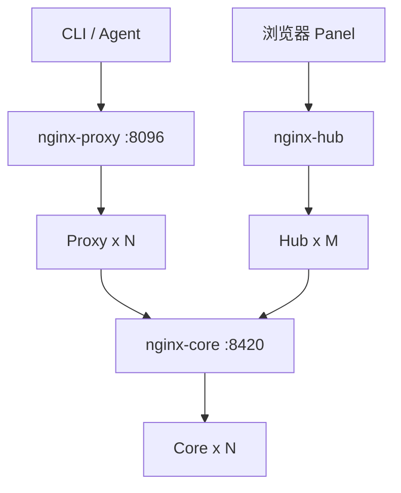

**基础设施依赖**（Proxy / Core / Hub 各自连什么）

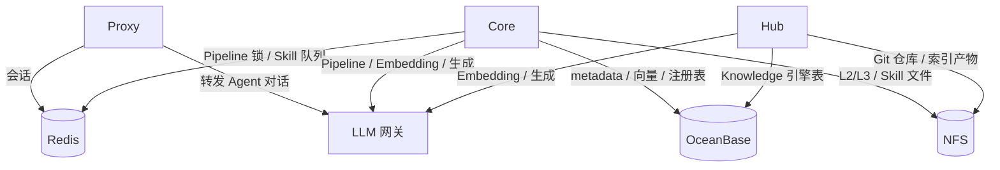

> Panel 用户 / Team / Agent 经 **Hub → nginx-core → Core**（见上图请求路径），Hub **不**单独连 MongoDB 类组件；结构化与向量数据统一进 **OceanBase**。

### 5.2 调用关系说明

| 调用路径 | 说明 |
|----------|------|
| **用户/Agent → Proxy** | 统一入口；Proxy 负责鉴权、会话、记忆注入 |
| **Proxy → Core** | 记忆 L0/L1/L2/L3、Skill、元数据（用户/Team/Key）等 **均经 nginx-core** |
| **Hub Panel → Core** | 管理台无独立用户库，Team/User/Agent 等 **全部调 Core** |
| **Agent 查 Wiki/CodeGraph → Hub Knowledge** | Knowledge 引擎 API 在 Hub `:8424`；Core 只存 Knowledge **注册信息** |
| **Core / Hub → LLM** | Embedding、生成类能力走公司 LLM 网关 |
| **Proxy / Core / Hub → Redis** | 会话、锁、队列（Core 多副本 **必须** Redis） |
| **Core / Hub → OceanBase** | 结构化数据 + 向量检索 |
| **Core / Hub → 文件存储** | 大文本、Git 仓库、索引文件（不进 OB） |

### 5.3 服务依赖矩阵

|  | Redis | OceanBase | 共享文件 | LLM | 依赖其他应用服务 |
|--|:-----:|:---------:|:--------:|:---:|:----------------|
| **Proxy** | ✅ 必须 | — | — | ✅ | Core（经 nginx-core） |
| **Core** | ✅ 必须（多副本） | ✅ 必须 | ✅ 必须 | ✅ | — |
| **Hub** | ✅ 建议（构建锁） | ✅ Phase4 后 | ✅ 必须 | ✅ | Core（Panel，经 nginx-core） |

---

## 六、存储分层与组件替换

### 6.1 现状 → 目标对照

| 能力 | 现状（Standalone） | 官方 Service | 目标（selfhosted-ha） |
|------|---------------------|-------------|---------------------|
| 用户 / Team / API Key | Core SQLite | MongoDB | **OceanBase** |
| 记忆向量 L0/L1 | Core SQLite | TCVDB | **OceanBase VECTOR** |
| Skill 向量 | Core SQLite | TCVDB | **OceanBase VECTOR** |
| L2/L3 / Skill 文件 | 本地盘 | COS | **NFS 共享目录** |
| Hub 引擎元数据 | Hub SQLite | — | **OceanBase** |
| 锁 / 会话 / 队列 | 本地 + Redis | Redis | **Redis** |

**不引入：** MongoDB、TCVDB、COS、PostgreSQL、独立向量数据库。

### 6.2 OceanBase 库内逻辑（单库 `agent_team_memory`）

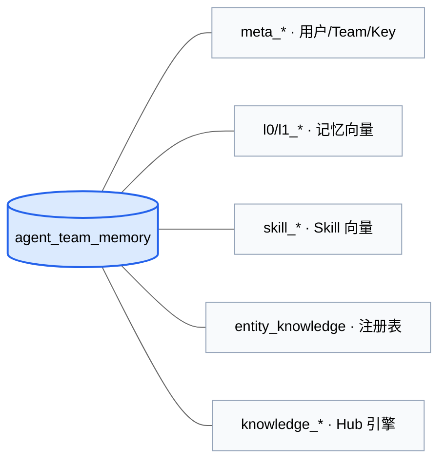

字符集：**utf8mb4 / utf8mb4_general_ci**（已建库）。

### 6.3 文件存储（不进 OB）

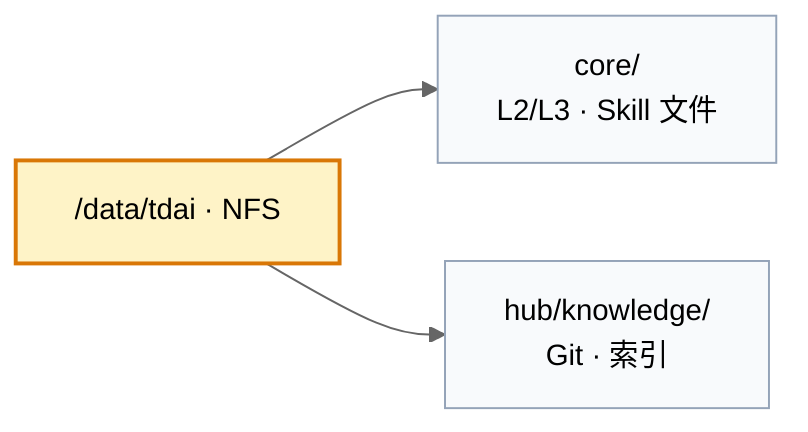

多 Core / 多 Hub 副本 **必须** 挂载同一共享目录（NFS）。

---

## 七、水平扩展设计

### 7.1 各服务扩展能力

| 服务 | 是否无状态 | 扩展方式 | 限制条件 |
|------|-----------|----------|----------|
| **Proxy** | 是（会话在 Redis） | 增加副本 + nginx-proxy | Redis 高可用 |
| **Core** | 是（状态在 OB/Redis/文件） | 增加副本 + nginx-core | **P3 完成前** 仅 1 副本；需 OB 适配 + Redis stateBackend |
| **Hub** | 部分无状态 | 增加副本 + nginx-hub | **P4 完成前** 仅 1 副本；需 Hub DB 迁 OB + 共享 knowledge 目录 |

### 7.2 首期与目标副本（单机 Docker 验证）

| 组件 | 验证期 | 目标态 |
|------|--------|--------|
| Proxy | 2 | 按负载 N |
| Core | 1 → **2**（P3 后） | 按负载 N |
| Hub | 1 → **2**（P4 后） | 按负载 M |
| nginx-* | 1 | 1（或 K8s Ingress 替代） |

**原则：** 应用加副本 **不增加** OB 库数量；所有副本共用同一连接串与 NFS（单 instance `default`）。

---

## 八、部署实施路径

### 8.1 阶段总览

### 8.2 一期：单机 Docker 多副本

**适用：** 开发联调、PoC、小流量预发。

| 项 | 做法 |
|----|------|
| 编排 | Docker Compose + `--scale proxy=2` 等 |
| 负载均衡 | 容器内 **nginx** 反向代理到多副本 |
| OB / Redis | 连接 **公司测试/生产** 地址（compose 不部署 OB） |
| 文件 | 宿主机 bind mount `/data/tdai`，验证通过后再挂 NFS |
| 交付物 | `deploy/selfhosted-ha/docker-compose.yml`、`.env.example`、`up.sh` |

### 8.3 二期：Kubernetes 部署

**适用：** 生产环境、跨节点扩展、与现有 K8s 体系一致。

| 项 | 做法 |
|----|------|
| 工作负载 | Proxy / Core / Hub 各一个 **Deployment**，`replicas` 可调 |
| 入口 | **Ingress** 或 LB Service（8096 / 8125 / 8424） |
| 内网 Core | ClusterIP Service `nginx-core:8420`，禁止 Pod 直连单个 Core Pod |
| 配置 | ConfigMap + Secret（`TDAI_OB_URI`、Redis、LLM） |
| 文件 | **PVC + NFS**（或公司存储类），Mount 路径与 Docker 一致 |
| OB / Redis | **ExternalName / 集群外 Endpoints**，不随 Pod 扩缩 |
| 交付物 | K8s manifests（Phase D，Compose 验证通过后编写） |

**Docker 与 K8s 拓扑一致：** 仅编排方式不同，服务划分、依赖、存储连接 **不变**。

### 8.4 研发分期（与部署对应）

| 阶段 | 研发内容 | 部署能力 |
|------|----------|----------|
| **P0** | compose / nginx / 文档骨架 | 单副本跑通 |
| **P1** | Proxy 多副本 | Proxy×2 + Redis |
| **P2** | Core metadata → OB | Core×1，OB 元数据 |
| **P3** | Core 向量 + Skill + Redis 锁 | **Core×2** |
| **P4** | Hub knowledge.db → OB | **Hub×2** |
| **P5** | NFS 文件切换 | 多副本共享文件 |
| **P6** | K8s manifests + 多机说明 | 生产 K8s |

详细任务见 [`2026-08-26-selfhosted-ha-oceanbase.md`](../../docs/superpowers/plans/2026-08-26-selfhosted-ha-oceanbase.md)；技术审查见 [`REVIEW.md`](./REVIEW.md)。

---

## 九、需协调的外部资源

| 资源 | 要求 | 责任方 |
|------|------|--------|
| OceanBase 租户 | MySQL 模式，**4.4.2**；库 **`agent_team_memory`**；账号 DDL + `DBMS_HYBRID_SEARCH` 权限 | DBA |
| Redis | 生产/测试实例；Core 与 Proxy 共用或分库前缀 | 中间件 |
| NFS（或等价共享存储） | 挂载路径 `/data/tdai`；Core/Hub 多副本共享 | 基础设施 |
| LLM 网关 | 现有 OpenAI 兼容接口；Embedding 维度需与向量表一致 | 平台/算法 |
| （可选）K8s 命名空间 / Ingress | Phase D 使用 | 容器平台 |

---

## 十、风险与对策（摘要）

| 风险 | 对策 |
|------|------|
| Core 向量适配工作量大 | 分 P2/P3 交付；P3 前 Core 保持单副本 |
| 向量维度与模型不一致 | 启动校验 + 与 LLM 团队确认 embedding 规格 |
| Hub 未完成 OB 迁移前扩副本 | 强制 hub replicas=1 直至 P4 |
| NFS 并发写文件 | Pipeline 锁走 Redis；文件路径规范不变 |
| 中文混合检索效果 | OB 4.4.2 POC；可降级纯向量检索 |

---

## 附录：相关文档

| 文档 | 读者 |
|------|------|
| [ARCHITECTURE.md](./ARCHITECTURE.md) | 研发 / 架构 — 目标拓扑、数据分层、配置、迁移 |
| [REVIEW.md](./REVIEW.md) | 研发 — 审查与风险 |
| [README.md](./README.md) | 全员 — 索引与 OB 对接清单 |
| [实施计划 P0–P6](../../docs/superpowers/plans/2026-08-26-selfhosted-ha-oceanbase.md) | 研发 — 任务与验收 |

**文档版本：** 2026-08-27 · 分支 `feat/selfhosted-ha-oceanbase`
