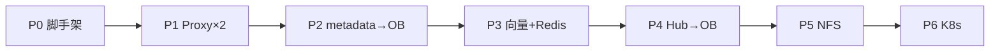

# Selfhosted HA 实施计划（OceanBase 4.4.2 + Redis）

> **分支：** `feat/selfhosted-ha-oceanbase`  
> **架构：** [ARCHITECTURE.md](../../deploy/selfhosted-ha/ARCHITECTURE.md)  
> **领导方案：** [PROPOSAL.md](../../deploy/selfhosted-ha/PROPOSAL.md)  
> **审查：** [REVIEW.md](../../deploy/selfhosted-ha/REVIEW.md)  
> **基线：** `deploy/internal-team`（Standalone 单机）；现网为 **Standalone 多实例分片**（见 PROPOSAL §2.6）

**目标：** 在单机上先验证 Proxy / Core / Hub 水平扩展；存储对接公司 **OceanBase 4.4.2**、**Redis**、文件目录 `/data/tdai`（后切 NFS）；**不**使用 MongoDB / TCVDB / COS / PostgreSQL。

**架构要点：**

- 新增 `deployMode: selfhosted` + 三套 adapter（MySQL metadata、OB vector memory/skill、Redis state）
- 应用层前接 nginx LB；Core/Hub 地址统一 `nginx-core:8420`
- **单 instance：** 固定 `instance_id=default`，单库 `agent_team_memory`，adapter **不按请求切库**
- 多 Team 隔离靠 `team_id` / `agent_id` / `user_id` 行级字段

**技术栈：** OB 4.4.2（MySQL 租户）、`mysql2`、Drizzle（Hub P4）、Redis 7、现有 memory-core/hub/proxy 镜像（二开）、nginx、Docker Compose → K8s。

---

## 全局约束

| 约束 | 说明 |
|------|------|
| OB | compose **不部署** OB；连公司已有 4.4.2 租户 |
| NFS | **仅** `/data/tdai/{core,hub}`；OB/Redis 数据目录 **不上** NFS |
| 路径 | 本机盘 → NFS 切换时，容器内路径 **不变** |
| Hub 副本 | P4 完成前 `hub replicas=1` |
| Core 副本 | P3 完成前 `core replicas=1` |
| 上游 | Proxy/Hub 的 Core 地址 → **`nginx-core:8420`** |
| 范围 | **不**改 `deploy/internal-team`；新栈 `deploy/selfhosted-ha` 并行 |
| 能力保留 | per-sk-mem MaaS、HTTP Git、Gateway API Key 留空策略等从 internal-team 延续 |
| 测试 | metadata 走 `metadata-store.contract.ts`；memory 移植 sqlite 合约测试 |
| 向量表 | hybrid 表须 `ORGANIZATION HEAP`；hybrid JSON 必须设 `_source` |

---

## 范围边界

| 本期做 | 本期不做 |
|--------|----------|
| `instance_id=default` | 多 `instance_id` 动态路由 |
| 单库 `agent_team_memory` | 按 instance 分库 |
| 行级 Team/Agent/User 隔离 | 现网多套分片 **合并进单库**（需单独立项） |
| Core/Hub/Proxy 水平扩展 | 官方 Service 模式 / integrations 子模块 |

---

## 文件清单（规划）

| 路径 | 职责 |
|------|------|
| `deploy/selfhosted-ha/docker-compose.yml` | 多副本 compose（无 OB 容器） |
| `deploy/selfhosted-ha/nginx/*.conf` | proxy / core / hub LB |
| `deploy/selfhosted-ha/.env.example` | 副本数、OB/Redis URI、路径 |
| `deploy/selfhosted-ha/up.sh` | 渲染配置 + 启动（参考 internal-team） |
| `deploy/selfhosted-ha/templates/*.yaml` | gateway / proxy 模板 |
| `MemoryCore/src/gateway/config.ts` | `selfhosted` deployMode |
| `MemoryCore/src/metadata/store/mysql-adapter.ts` | `IMetadataStore` |
| `MemoryCore/src/core/store/ob-vector.ts` | `IMemoryStore` |
| `MemoryCore/src/core/skill/ob-vector-skill-store.ts` | `ISkillStore` |
| `MemoryCore/src/core/store/store-pool.ts` | `StoreMode: obvector` |
| `MemoryCore/scripts/db/oceanbase-init.sql` | DDL |
| `MemoryCore/scripts/migrate-sqlite-to-oceanbase/` | 离线迁移 CLI |

---

## 阶段总览



| 阶段 | 部署能力 | Core 副本 | Hub 副本 | 依赖外部 |
|------|----------|-----------|----------|----------|
| P0 | 单副本骨架 | 1 | 1 | — |
| P1 | Proxy×2 | 1 | 1 | Redis |
| P2 | OB metadata | 1 | 1 | OB 测试库 |
| P3 | **Core×2** | **2** | 1 | OB + Redis |
| P4 | **Hub×2** | N | **2** | OB + 共享 hub 目录 |
| P5 | NFS 文件 | N | N | NFS |
| P6 | K8s | N | N | 容器平台 |

---

## P0 — 脚手架（不改运行时行为）

**交付：** `deploy/selfhosted-ha/*` 骨架 + 文档

- [ ] **P0-1** `docker-compose.yml`：`redis`、`nginx-proxy`、`nginx-core`、`nginx-hub`、`proxy`、`memory-core`、`memory-hub`；**无 OB 服务**；bind mount `./data/tdai` → `/data/tdai`
- [ ] **P0-2** `nginx/proxy.conf`、`core.conf`、`hub.conf`：`proxy_read_timeout 600s`，SSE 关 `proxy_buffering`
- [ ] **P0-3** `.env.example`：`PROXY_REPLICAS=2`、`CORE_REPLICAS=1`、`HUB_REPLICAS=1`、`TDAI_OB_URI`、`REDIS_*`、路径变量
- [ ] **P0-4** `up.sh` / `render-config.py`：参考 `deploy/internal-team`，渲染 `templates/` → `runtime/`
- [ ] **P0-5** scalable 服务 **去掉** `container_name`（与 REVIEW A5 一致）
- [ ] **P0-6** README：OB 对接清单、文档索引（对齐 PROPOSAL 附录）

**验收：**

```bash
docker compose -f deploy/selfhosted-ha/docker-compose.yml config
# 无语法错误；环境变量占位完整
```

**工期参考：** 2–3 人日

---

## P1 — Proxy 水平扩展（零 Core 二开）

**前提：** P0 完成；Redis 可用（公司或 compose 内）

- [ ] **P1-1** `proxy` 服务不暴露 host port；仅 `nginx-proxy:8096` 对外
- [ ] **P1-2** `proxy-config.yaml`：`externalGatewayUrl` → `http://${PUBLIC_HOST}:${PROXY_PORT}`（LB 地址）
- [ ] **P1-3** `tdai.serviceId: default`；`endpoint` 暂指单 Core 或 nginx-core（P3 前 core=1）
- [ ] **P1-4** `--scale proxy=2` 启动；验证 Redis 会话跨 Proxy 副本保持
- [ ] **P1-5** `verify-proxy-scale.sh`：health + 重启一个 proxy 后会话仍有效

**验收：**

- 同事访问 `:8096` 正常
- 杀掉一个 proxy 容器，已选 Team/Agent 会话不丢（Redis AOF）

**工期参考：** 2 人日

---

## P2 — Metadata 迁入 OceanBase

**前提：** DBA 提供测试库 `agent_team_memory`；P0 compose 可起 Core

- [ ] **P2-1** `oceanbase-init.sql`：`meta_*` 表 DDL（InnoDB/HEAP 按 OB 文档）
- [ ] **P2-2** 合约测试：`metadata-store.contract.ts` 对 mysql adapter **先红后绿**
- [ ] **P2-3** 实现 `MysqlMetadataStore`（镜像 `sqlite-adapter.ts` 表结构）
- [ ] **P2-4** `factory.ts`：selfhosted 走 `mysql`；`TDAI_OB_URI` 固定库 `agent_team_memory`
- [ ] **P2-5** `config.ts`：增加 `deployMode: selfhosted`；默认 `stateBackend: redis`（P3 前可先 local 单副本）
- [ ] **P2-6** 启动校验：selfhosted **必填** `TDAI_OB_URI`；**禁止** SQLite metadata 路径与 OB 同时配置（REVIEW A2）
- [ ] **P2-7** `mysql2/promise` 连接池 + 事务

**此阶段 Core 仍用 SQLite vectors.db**；仅 metadata 走 OB。

**验收：**

```bash
npm test -- metadata-store.contract   # mysql adapter 通过
# 单 Core 启动，Panel 建用户/Team/Key 写入 OB
```

**迁移（可选试点）：**

- [ ] **P2-8** `migrate-sqlite-to-oceanbase metadata` 子命令（从现网某套 Core Volume 导出）

**工期参考：** 5–8 人日

---

## P3 — 向量 + Skill + Redis 状态（主路径）

**范围（REVIEW 定稿）：** 移植 `sqlite.ts` **全量**——L0/L1、entity 镜像、audit、prompts、**`entity_knowledge`**；Hub `knowledge.db` **仍 SQLite** 至 P4。

**前提：** P2 完成；embedding 模型与维度已确认（REVIEW A3）

- [ ] **P3-1** `oceanbase-init.sql` 补充：HEAP 向量表、`entity_knowledge`、镜像表；`FULLTEXT` + `VECTOR INDEX`
- [ ] **P3-2** `ObVectorMemoryStore implements IMemoryStore`（自 `sqlite.ts` 移植）
- [ ] **P3-3** Hybrid：`DBMS_HYBRID_SEARCH.SEARCH` JSON 封装 + `_source` 白名单；`vector` 策略降级路径
- [ ] **P3-4** `ObVectorSkillStore implements ISkillStore`
- [ ] **P3-5** `store-pool.ts`：`StoreMode: obvector`；selfhosted **singleton**，仅 `default`
- [ ] **P3-6** `skill.extraction.queue.backend: redis`；`StatefulPipelineManager` + `RedisSkillAgentTaskQueue`
- [ ] **P3-7** `templates/tdai-gateway.yaml`（selfhosted 块）；`up.sh` 渲染
- [ ] **P3-8** 启用 `nginx-core`；`--scale memory-core=2`；Proxy/Hub → `nginx-core:8420`
- [ ] **P3-9** `migrate-sqlite-to-oceanbase vectors` 子命令 + README
- [ ] **P3-10** 启动校验：embedding 维度 vs `VECTOR(n)` vs `embedding_meta`
- [ ] **P3-11** POC：中文 content hybrid 检索；记录 fallback 配置

**验收：**

- Core A 写入 L0/L1，Core B 可读
- `createKnowledge` 注册表 round-trip（OB `entity_knowledge`）
- Pipeline：同一时刻仅一个 L2 任务（Redis 锁）
- hybrid search 有结果；或文档记录 vector-only fallback

**强制：** 本阶段完成前 **禁止** `core replicas>1` 以外的多写路径（SQLite 向量已下线）。

**工期参考：** 15–25 人日（风险最高，见 REVIEW R1）

---

## P4 — Hub 引擎库迁入 OceanBase

**范围：** 仅 Hub `knowledge.db` Drizzle schema；**不含** Core `entity_knowledge`（已在 P3）

**前提：** P3 完成；`/data/tdai/hub/knowledge` 已挂载（可先本机盘）

- [ ] **P4-1** Knowledge `db/client.ts`：MySQL 驱动路径（Drizzle + `mysql2`）；`KNOWLEDGE_DATABASE_URL` 或共用 `TDAI_OB_URI`
- [ ] **P4-2** schema 迁入 `agent_team_memory` 的 `knowledge_*` 表
- [ ] **P4-3** CodeGraph 构建 **Redis 锁**（按 `code_graph_id` 互斥）
- [ ] **P4-4** `nginx-hub` + `--scale memory-hub=2`
- [ ] **P4-5** Hub `metadata-instances.json`：仅 **一个** instance `default` → nginx-core
- [ ] **P4-6** 迁移脚本：`knowledge.db` → OB（试点环境）

**验收：**

- hub-1 ingest CodeGraph；hub-2 可查询
- 无 Redis 锁时不会双副本同时 build 同一 graph

**工期参考：** 8–12 人日

---

## P5 — NFS 切换（运维）

**前提：** P4 完成；基础设施提供 NFS export

- [ ] **P5-1** 停栈；`rsync` `/data/tdai` → NFS；改 compose volume 为 NFS mount
- [ ] **P5-2** 容器内路径仍为 `/data/tdai/core`、`/data/tdai/hub/knowledge`
- [ ] **P5-3** 回归：双 Core + 双 Hub 均可见同一 L2 文件与 Git 目录
- [ ] **P5-4** runbook 写入 ARCHITECTURE §12

**验收：** 所有副本读写同一文件；Pipeline 锁仍正常

**工期参考：** 1–2 人日（含运维协调）

---

## P6 — Kubernetes 与多机

**前提：** Docker Compose 全阶段验收通过

- [ ] **P6-1** Deployment：`proxy` / `core` / `hub` 各一份，`replicas` 可调
- [ ] **P6-2** Service：ClusterIP `nginx-core:8420`；Ingress 8096 / 8125 / 8424
- [ ] **P6-3** ConfigMap + Secret：`TDAI_OB_URI`、Redis、LLM
- [ ] **P6-4** PVC + NFS StorageClass；mount 路径与 Docker 一致
- [ ] **P6-5** OB / Redis：ExternalName 或 Endpoints（集群外）
- [ ] **P6-6** 多机说明：新节点只跑应用副本，OB/Redis  endpoint 不变

**验收：** K8s 环境与 Compose **拓扑等价**（PROPOSAL §8.3）

**工期参考：** 5–8 人日

---

## 单 instance 隔离检查项

- [ ] **I-1** 全栈固定 `TDAI_INSTANCE_ID=default`、`TDAI_OB_URI` 单库
- [ ] **I-2** Proxy `serviceId: default`；路径 `/claude-code/default`
- [ ] **I-3** Hub `REMOTE_INSTANCE_ID=default`；instances.json 仅一条
- [ ] **I-4** adapter **不**调用 `resolveMetadataDbName` 按请求切库
- [ ] **I-5** Team/Agent/User 隔离仅依赖 `IsolationFilter` 列

---

## 测试策略

| 层级 | 内容 |
|------|------|
| Metadata | `metadata-store.contract.ts` @ mysql |
| Memory | sqlite store 测试移植；dev OB 集成测试 |
| Hybrid | 插入 FULLTEXT+VECTOR 行；`DBMS_HYBRID_SEARCH` smoke |
| 扩展 | `verify-proxy-scale.sh`；双 Core read-after-write 脚本 |
| 迁移 | 现网 SQLite Volume 拷贝上 dry-run migrate CLI |
| 回归 | internal-team 能力：MaaS key、HTTP git、sessionInit |

---

## 从现网分片迁移（运维）

与 [ARCHITECTURE §12](../../deploy/selfhosted-ha/ARCHITECTURE.md#12-从现网迁移) 一致：

1. **新栈并行**：不改动现网 N 套 Proxy–Core
2. **择一试点 instance**：P2/P3 迁移脚本导入该 Core 的 SQLite
3. **Hub**：新 Hub 只连 `default`；旧 Hub 多 instance 配置逐步下线
4. **多 instance 合并**：若业务要求多套并入单库 → **单独立项**，不在 P0–P6

---

## 提交策略（建议）

1. `docs(deploy): align selfhosted-ha architecture with PROPOSAL`
2. `feat(deploy): selfhosted-ha compose + nginx (P0/P1)`
3. `feat(core): deployMode selfhosted + mysql metadata (P2)`
4. `feat(core): obvector memory/skill stores (P3)`
5. `feat(knowledge): mysql backend for hub (P4)`
6. `docs(deploy): nfs cutover runbook (P5)`
7. `feat(deploy): k8s manifests (P6)`

---

## 外部协调（按阶段）

| 阶段 | 需要 |
|------|------|
| P0 | — |
| P2+ | OB 测试库账号、`DBMS_HYBRID_SEARCH` 权限 |
| P1+ | Redis 实例或 compose 内 Redis |
| P5 | NFS export `/data/tdai` |
| P6 | K8s 命名空间、Ingress、StorageClass |
| 全程 | LLM embedding 维度确认 |

详见 [PROPOSAL §九](../../deploy/selfhosted-ha/PROPOSAL.md#九需协调的外部资源)。

---

## 参考

- [OceanBase 4.4.2 Hybrid Search](https://www.oceanbase.com/docs/common-oceanbase-database-1000000000183278)
- [`deploy/internal-team/`](../../deploy/internal-team/) — 单机 Standalone 模板
- [`MemoryCore/src/metadata/store/interface.ts`](../../MemoryCore/src/metadata/store/interface.ts)
- [`MemoryCore/src/core/store/sqlite.ts`](../../MemoryCore/src/core/store/sqlite.ts) — P3 移植源
- [已废弃 PG 方案](./2026-08-26-selfhosted-ha-postgres-pgvector.md)

**文档版本：** 2026-08-27 · 与 PROPOSAL / ARCHITECTURE 对齐
